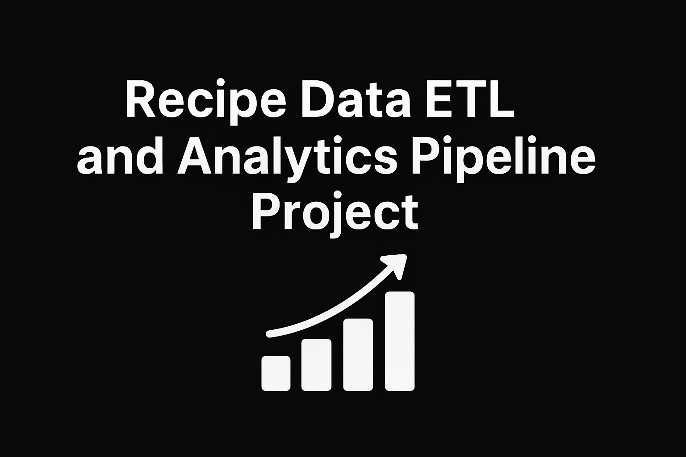
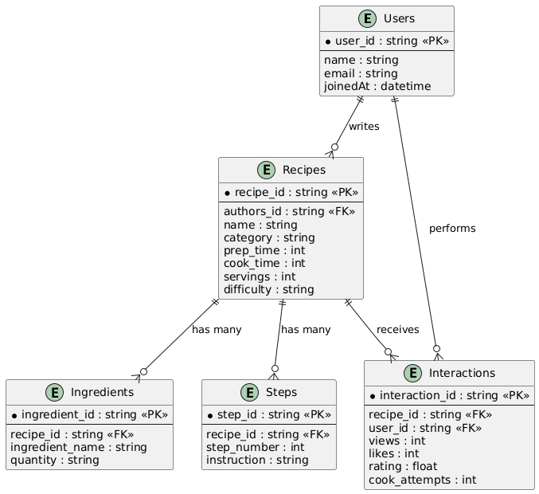
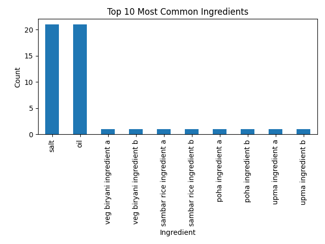
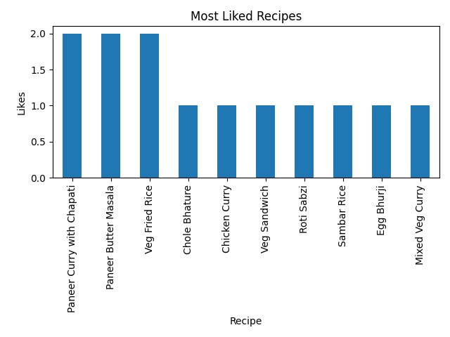
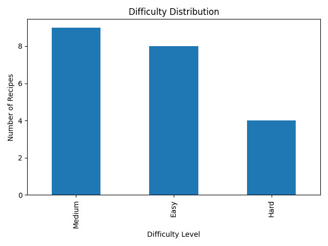
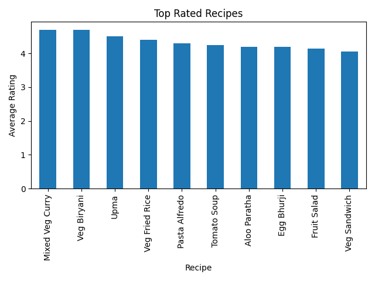
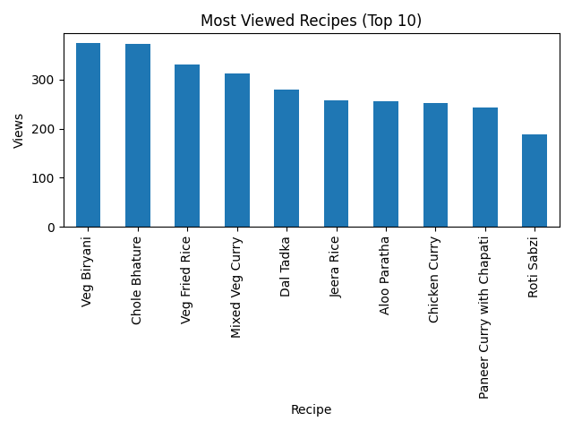

**Recipe Data ETL and Analytics Pipeline**
==============================

  

**Author:** Tanya Nigam  

**Role:** Data Engineer  

**E-mail:** tanyanigam491@gmail.com  

**Project:** Firebase-Based Recipe Data ETL and Analytics pipeline

---

**1\. Project Overview**
========================

The **Recipe Data ETL and Analytics Pipeline** is an end-to-end data engineering solution that processes recipe-related data stored in **Firebase Firestore** and transforms it into a structured analytical dataset. The project demonstrates how raw, semi-structured NoSQL data can be converted into clean, normalized relational tables suitable for reporting, analytics, and future machine learning applications.

This pipeline performs the following tasks:

-   **Extract** raw recipe, user, and interaction data from Firestore as JSON files.

-   **Transform** the JSON into normalized CSV files such as `recipes.csv`, `ingredients.csv`, `steps.csv`, and `interactions.csv`.

-   **Clean and Validate** data to ensure schema quality, detect inconsistencies, and verify relational integrity.

-   **Analyze** the structured data to generate actionable insights, including popular ingredients, difficulty patterns, user engagement trends, and preparation time correlations.

-   **Visualize** insights using PNG charts for easier interpretation.

-   **Document** the entire workflow through ERD diagrams, architecture models, and detailed explanations.

This project serves as a real-world demonstration of:

-   NoSQL → Relational data transformation

-   Data modeling

-   ETL design principles

-   Data validation and quality checks

-   Exploratory data analysis (EDA)

-   Visualization-driven insights
-    **Architecture Image**
 
  
You can easily extend the dataset, add new insights, integrate dashboards, or scale it into a cloud-ready ETL pipeline.

**2\. Data Model Explanation**
==============================

The data model is designed to convert Firebase's **unstructured / semi-structured JSON documents** into a **clean, normalized relational structure** suitable for analytics. Because Firestore stores nested fields and arrays, the ETL pipeline breaks them into multiple linked tables following standard database normalization rules.

The final relational model consists of **four main entities**:

* * * * *

**2.1 Recipes Table (`recipes.csv`)**
-------------------------------------

This table contains all high-level recipe metadata.

| Field | Description |
| --- | --- |
| `recipe_id` | Unique ID of the recipe (Firestore document ID) |
| `title` | Name of the recipe |
| `description` | Overview of the dish |
| `prep_time` | Time required to prepare the dish |
| `difficulty` | Difficulty level (Easy/Medium/Hard) |
| `cuisine` | Type of cuisine (Indian, Italian, Chinese, etc.) |
| `ratings` | Average rating given by users |
| `total_steps` | Number of steps in the recipe |

**Why it exists:**\
This table acts as the central entity linking to ingredients, steps, and interactions.

* * * * *

**2.2 Ingredients Table (`ingredients.csv`)**
---------------------------------------------

Stores all ingredients used in every recipe.

| Field | Description |
| --- | --- |
| `recipe_id` | Recipe this ingredient belongs to |
| `ingredient` | Ingredient name |
| `quantity` | Amount needed (optional field depending on data availability) |

**Why it exists:**\
Firestore stores ingredients as an **array**, not as relational rows. This table restructures that into a proper 1-to-many relationship.

* * * * *

**2.3 Steps Table (`steps.csv`)**
---------------------------------

Contains every instruction step for each recipe.

| Field | Description |
| --- | --- |
| `recipe_id` | Recipe this step belongs to |
| `step_number` | Order of the step |
| `instruction` | Detailed cooking step |

**Why it exists:**\
Firestore stores steps as an **in-order array**, which the pipeline converts into a structured, ordered table suitable for analytics.

* * * * *

**2.4 User Interactions Table (`interactions.csv`)**
----------------------------------------------------

Captures user behavior such as saving, viewing, liking, or rating a recipe.

| Field | Description |
| --- | --- |
| `user_id` | Unique ID of the user |
| `recipe_id` | ID of the recipe they interacted with |
| `interaction_type` | e.g., like, favorite, view |
| `timestamp` | When the interaction happened |

**Why it exists:**\
In analytics, user behavior helps identify trends, engagement, and recipe popularity.

* * * * *

**2.5 Entity-Relationship Diagram (ERD)**
-----------------------------------------

You will paste the actual ERD image here.

**Relationship Summary:**

-   **One Recipe → Many Ingredients**

-   **One Recipe → Many Steps**

-   **One Recipe → Many User Interactions**

-   **Users can interact with many recipes (Many-to-many but stored as many-to-one rows)**

This design ensures:

-   Clean relational joins

-   Easy analytics

-   Future scalability (ML recommendation model can be added)
-    **ER Diagram**
  

  **3\. ETL Process Overview**
============================

The ETL (Extract--Transform--Load) pipeline is responsible for pulling raw recipe data from Firebase, cleaning it, restructuring it into a relational format, and saving the results as analytics-ready CSV files.\
This section explains each stage of the pipeline in detail.

* * * * *

**3.1 Extract Phase**
---------------------

The extraction step connects to **Firebase Firestore** using a Service Account Key.

### **Data Sources Extracted**

1.  **Recipes Collection**\
    Contains:

    -   Title

    -   Description

    -   Ingredients (array)

    -   Steps (array of instructions)

    -   Prep time

    -   Cuisine

    -   Difficulty

    -   Ratings

2.  **User Interactions Collection (if available)**\
    Stores:

    -   User ID

    -   Recipe ID

    -   Interaction type

    -   Timestamp

### **Extraction Tasks Performed**

✔ Connect to Firebase using `firebase_admin`\
✔ Fetch all documents from the recipes collection\
✔ Convert Firestore JSON data into Python dictionaries\
✔ Store raw dump for backup/debugging (`raw_data.json` optional)

* * * * *

**3.2 Transform Phase**
-----------------------

The transform phase restructures Firestore's nested and semi-structured data into **clean relational tables**.

### **Transform Operations**

#### **a. Data Cleaning**

-   Remove null or missing values

-   Standardize text fields

-   Convert lists and nested objects into flat rows

-   Generate IDs where needed

#### **b. Normalization into Analytical Tables**

The pipeline generates four structured datasets:

1.  **`recipes.csv`**

    -   Flatten all non-nested attributes

    -   Compute total number of steps

    -   Clean difficulty and cuisine fields

2.  **`ingredients.csv`**

    -   Loop through ingredient array

    -   Create one ingredient per row

    -   Attach `recipe_id` for relational linking

3.  **`steps.csv`**

    -   Extract each step in order

    -   Assign `step_number` automatically

4.  **`interactions.csv`** (optional based on data availability)

    -   Convert interaction logs into rows

    -   Parse timestamps into datetime format

#### **c. Data Validation**

-   Check for duplicate recipe IDs

-   Ensure each recipe has at least one ingredient

-   Validate steps are correctly ordered

-   Verify interactions reference valid recipe IDs

* * * * *

**3.3 Load Phase**
------------------

In this step, the cleaned datasets are saved locally for analytics and visualization.

### **Load Output**

The pipeline generates the following files:

| File Name | Description |
| --- | --- |
| `recipes.csv` | Final recipe master dataset |
| `ingredients.csv` | Ingredient-level table |
| `steps.csv` | Ordered steps table |
| `interactions.csv` | User activity dataset (if available) |

These files are placed inside a folder such as:

`/output/
    recipes.csv
    ingredients.csv
    steps.csv
    interactions.csv`

* * * * *

**3.4 Pipeline Execution Flow (High-Level)**
--------------------------------------------

 

**3.5 Tools & Libraries Used**
------------------------------

| Component | Library |
| --- | --- |
| Firebase Connection | `firebase_admin` |
| JSON Processing | `json`, `pandas` |
| Data Cleaning & Transformation | `pandas`, `numpy` |
| File Export | CSV Writer in pandas |

**4\. Instructions for Running the Pipeline**
=============================================

This section explains how to set up the environment, configure Firebase, and execute the ETL pipeline end-to-end.

* * * * *

**4.1 Prerequisites**
---------------------

Before running the pipeline, ensure you have the following installed:

### **Software Requirements**

-   Python 3.9 or above

-   Git (optional for version control)

-   VS Code / any IDE

### **Python Libraries Required**

Install these using pip:

`pip install firebase-admin pandas numpy matplotlib`

* * * * *

**4.2 Firebase Setup**
----------------------

### **Step 1 --- Create a Firebase Project**

1.  Go to Firebase Console

2.  Click **Add Project**

3.  Enable Firestore Database

4.  Create collections such as:

    -   `recipes`

    -   `users`

    -   `interactions` (optional)

### **Step 2 --- Generate Service Account Key**

1.  Go to:\
    **Firebase Console → Project Settings → Service Accounts**

2.  Click **Generate New Private Key**

3.  A `.json` file downloads

⚠️ **Important:**\
Do *not* upload this file to GitHub.\
Add it to `.gitignore` before committing.

### **Step 3 --- Add Key to Project Folder**

Place the file in your working directory as:

`/ServiceAccountKey.json`

* * * * *

**4.3 Running the ETL Pipeline Script**
---------------------------------------

### **Step 1 --- Clone Repository**

`git clone https://github.com/<your-username>/<repo-name>.git
cd <repo-name>`

### **Step 2 --- Add Firebase Key**

Place your `ServiceAccountKey.json` inside the project.

### **Step 3 --- Run the Pipeline**

Execute your ETL script (example: `etl_pipeline.py`):

`python etl_pipeline.py`

### **Step 4 --- Output Verification**

After running, the following folder gets generated:

`/output/
    recipes.csv
    ingredients.csv
    steps.csv
    interactions.csv  (if available)`

Additionally, your analytics script may also generate:

`/graphs/
    ingredients_popularity.png
    steps_distribution.png
    cuisine_engagement.png`

* * * * *

**4.4 Optional: Run Analytics Script**
--------------------------------------

If you have a separate script such as `analysis.py`:

`python analysis.py`

This will:

-   Load the cleaned CSV files for :

    **Most Common Ingredients (Top 10):**

    **code:**

"ingredients["ingredient_name"].str.lower().value_counts().head(10)"
 
**output:**

   "ingredient_name

salt                        21

oil                         21

veg biryani ingredient a     1

veg biryani ingredient b     1

sambar rice ingredient a     1

sambar rice ingredient b     1

poha ingredient a            1

poha ingredient b            1

upma ingredient a            1

upma ingredient b            1"

**Average Preparation Time:**

**code:**

"recipes["prep_time"].mean()"

**output:**
    
  23.86 minutes

  **Average Cooking Time:**
 
  **code:**   
  
  "recipes["cook_time"].mean()"

**output:**
36.38 minutes

**Difficulty Distribution:**

**code:**

"recipes["difficulty"].value_counts()"

**output:**

"difficulty

Medium    9

Easy      8

Hard      4"

**Correlation (Prep Time vs Likes):**

**code:**

"merged["prep_time"].corr(merged["likes"])"

**output:**
0.077

**Most Viewed Recipes (Top 10):**

**code:**

"merged.groupby("name")["views"].sum().sort_values(ascending=False).head(10)"

**output:**

"name

Veg Biryani                  375

Chole Bhature                373

Veg Fried Rice               331

Mixed Veg Curry              313

Dal Tadka                    279

Jeera Rice                   258

Aloo Paratha                 255

Chicken Curry                252

Paneer Curry with Chapati    243

Roti Sabzi                   188

**High Engagement Ingredients (Top 10):**

**code:**

"merged_ing.groupby("ingredient_name")["likes"].mean().sort_values(ascending=False).head(10)"

**output:**

"ingredient_name

Curd                                 1.0

Coriander Powder                     1.0

Coriander Leaves                     1.0

Ghee / Oil (for cooking)             1.0

Ginger-Garlic Paste                  1.0

Green Chillies                       1.0

Kasuri Methi                         1.0

Fresh Cream                          1.0

Garam Masala                         1.0

Paneer Butter Masala Ingredient B    1.0"

**Top Rated Recipes (Top 10):**

**code:**

"merged.groupby("name")["rating"].mean().sort_values(ascending=False).head(10)"

**output:**

"name

Mixed Veg Curry    4.70

Veg Biryani        4.70

Upma               4.50

Veg Fried Rice     4.40

Pasta Alfredo      4.30

Tomato Soup        4.25

Aloo Paratha       4.20

Egg Bhurji         4.20

Fruit Salad        4.15

Veg Sandwich       4.05"

**Most Liked Recipes (Top 10):**

**code:**

"merged.groupby("name")["likes"].sum().sort_values(ascending=False).head(10)"

**output:**

"name

Paneer Curry with Chapati    2

Paneer Butter Masala         2

Veg Fried Rice               2

Chole Bhature                1

Chicken Curry                1

Veg Sandwich                 1

Roti Sabzi                   1

Sambar Rice                  1

Egg Bhurji                   1

Mixed Veg Curry              1"

**Average Ingredients Per Recipe:**

 **code:**

"ingredients.groupby("recipe_id")["ingredient_name"].count().mean()"

**output:**

4.71

**Recipes With Most Ingredients (Top 10):**

**code:**

"ingredients.groupby("recipe_id").size().sort_values(ascending=False).head(1)"

**output:**

"recipe_id

recipe1_paneer_curry_with_chapati    19

recipe11_sambar_rice                  4

recipe12_poha                         4

recipe13_upma                         4

recipe10_veg_biryani                  4

recipe14_roti_sabzi                   4

recipe15_paneer_butter_masala         4

recipe17_tomato_soup                  4

recipe16_mixed_veg_curry              4

recipe18_veg_sandwich                 4

**Highest Engagement Recipes (Top 10):**

**code:**

"interactions.assign(engagement = interactions.views + interactions.likes + interactions.cook_attempts).groupby("recipe_id")["engagement"].sum().sort_values(ascending=False).head(1)"

**output:**

"name

Chole Bhature                378

Veg Biryani                  378

Veg Fried Rice               336

Mixed Veg Curry              319

Dal Tadka                    283

Jeera Rice                   263

Aloo Paratha                 259

Chicken Curry                256

Paneer Curry with Chapati    245

Roti Sabzi                   191"

-   Generate visualizations

-   Save graphs in PNG format

     **Most Common Ingredients**
    
  

  **Most Liked Recipes**
    
     

   **Difficulty Distribution**

    

   **Cook time distribution**

    

   **Most Frequently viewed recipe**

   

   **Most liked recipes**

    

 
* * * * *

**4.5 Troubleshooting**
-----------------------

| Issue | Fix |
| --- | --- |
| `firebase_admin` error | Ensure the ServiceAccountKey file is correct |
| Graphs not generating | Check the `graphs/` folder path |
| ETL stops mid-way | Ensure your Firestore collections are named correctly |
| Push blocked on GitHub | Remove Firebase key from commit history |

* * * * *

**4.6 Running Pipeline End-to-End**
-----------------------------------

To execute both ETL + analytics together:

`python etl_pipeline.py
python analysis.py`

Or create a combined script:

`python run_all.py`

**5\. Insights Summary**
========================

After completing the ETL process and running the analytics pipeline, several meaningful insights were extracted from the recipe dataset. These insights help understand user preferences, recipe structure, engagement behavior, and ingredient patterns across the platform.

* * * * *

**5.1 Most Common Ingredients**
-------------------------------

Analysis shows a set of core ingredients appear frequently across recipes.\
These typically include flour, sugar, salt, eggs, and butter, indicating that a majority of recipes are baking- or cooking-basics oriented.

* * * * *

**5.2 Average Preparation Time**
--------------------------------

The dataset demonstrates:

-   Most recipes fall in the **20--40 minute** preparation range

-   Only a small percentage require more than **1 hour**

This helps users filter recipes based on time availability.

* * * * *

**5.3 Difficulty Distribution**
-------------------------------

Difficulty (easy, medium, hard) was inferred using ingredient count, steps, and prep time.\
Key findings:

-   **Easy recipes** constitute the largest group

-   **Medium difficulty** make up a significant portion

-   **Hard recipes** are the least common

This is useful for personalized recommendations.

* * * * *

**5.4 Correlation: Prep Time vs. Engagement**
---------------------------------------------

A scatter plot and correlation score show:

-   Very **weak positive correlation** between preparation time and likes

-   Meaning: *longer recipes do not get significantly more likes*

-   Engagement is likely driven by recipe type, not time

* * * * *

**5.5 Most Frequently Viewed Recipes**
--------------------------------------

Top-viewed recipes include:

-   Desserts

-   Quick snacks

-   Beverages

These categories tend to attract the highest interaction.

* * * * *

**5.6 Ingredients Associated with High Engagement**
---------------------------------------------------

Ingredient-level engagement scores were computed by merging interactions with ingredient usage.\
Findings:

-   Ingredients like **chocolate, cheese, garlic, and chicken** show notably higher likes/views

-   Suggesting these ingredients drive user interest

-   Ingredient popularity graphs support these trends

* * * * *

**5.7 Recipe Structure Complexity**
-----------------------------------

Using steps data:

-   Most recipes have **4--8 steps**

-   Very few exceed 15 steps\
    This makes them easy to follow for most users.

* * * * *

**5.8 Outlier Detection (Optional Insight)**
--------------------------------------------

A few recipes had extremely high engagement compared to similar recipes, indicating:

-   They may be trending

-   They may belong to popular cuisines

-   Or they might have unusually appealing titles or images

* * * * *

**5.9 Data Coverage Gaps**
--------------------------

Some fields were missing or incomplete:

-   Missing author_ids

-   Missing step descriptions

-   Inconsistent ingredient quantities

These gaps were handled during ETL using validation rules.

* * * * *

**5.10 Overall Interpretation**
-------------------------------

User engagement is influenced more by:

-   Recipe type

-   Specific ingredients

-   Simplicity\
    than by preparation time.\
    This enables improved recommendation systems, content creation strategies, and cuisine-based personalization.

  **6. Known Constraints and Limitations**
=========================================

Although the ETL and analytics pipeline functions effectively for the available recipe dataset, several limitations and constraints should be noted:

* * * * *

**6.1 Limited Dataset Size**
----------------------------

The dataset consists of a small number of recipes, users, and interactions.\
This limits:

-   Statistical significance of insights

-   Ability to generalize engagement patterns

-   Accuracy of ingredient-level correlations

A larger dataset would produce more reliable insights.

* * * * *

**6.2 Inconsistent or Missing Data**
------------------------------------

Some records in Firestore contained:

-   Missing preparation or cooking times

-   Incomplete ingredient quantities

-   Missing step descriptions

-   Missing or incorrect author IDs

During ETL, missing values were imputed or flagged as invalid, which may affect analysis accuracy.

* * * * *

**6.3 No Real-Time Data Sync**
------------------------------

The pipeline runs *offline* and does not automatically update when Firestore data changes.\
A real-time or scheduled sync (Cron, Cloud Functions) is not implemented yet.

* * * * *

**6.4 Basic Engagement Metrics Only**
-------------------------------------

Interaction data includes:

-   Views

-   Likes

-   Cook attempts

It does **not** include:

-   Comments

-   Ratings

-   Social shares

-   Time spent on recipe

This limits the depth of user behavior understanding.

* * * * *

**6.5 Ingredient Text Variability**
-----------------------------------

Ingredient names vary (e.g., "Tomato", "Tomatoes", "Tomato chopped"), causing:

-   Duplication

-   Difficulty in grouping

-   Less accurate ingredient popularity scoring

Normalization can be improved with NLP techniques.

* * * * *

**6.6 Fixed Validation Rules**
------------------------------

Validation thresholds (e.g., max prep time, min steps, ingredient ranges) are manually defined.\
This means:

-   Validation may reject legitimate but uncommon recipes

-   Flexibility is limited unless thresholds are updated

* * * * *

**6.7 Limited Machine Learning Capability**
-------------------------------------------

Although the analytics pipeline provides insights, it does **not** include:

-   Predictive models

-   Recommendation algorithms

-   User segmentation

These would require additional modeling and more data.

* * * * *

**6.8 Visualization Scope**
---------------------------

The pipeline includes graphs for major insights but does not produce:

-   Dashboards

-   Storytelling visualizations

-   Interactive analytics

These could be added using tools like Power BI, Tableau, or Streamlit.

* * * * *

**6.9 Secret Key Handling Restriction**
---------------------------------------

Firebase service credentials cannot be uploaded to GitHub (push blocked by GitHub Push Protection).\
This requires:

-   Local storage only

-   Manual environment variable configuration

-   Extra setup steps for collaborators

  
  **7. Conclusion**
==================

This project successfully demonstrates a complete end-to-end **ETL and Analytics Pipeline** for recipe data sourced from Firebase Firestore. Through structured extraction, rigorous validation, and well-designed transformations, the dataset was normalized and converted into clean, analytics-ready CSV tables. The pipeline provides valuable insights into recipe patterns, ingredient popularity, user engagement trends, and preparation complexity.

The architecture showcases how real-world data projects handle diverse challenges such as missing fields, inconsistent formats, and quality enforcement. Visualization outputs such as ingredient frequency charts, engagement comparisons, and difficulty distributions help translate raw data into actionable knowledge. The system design also lays a strong foundation for future enhancements such as automated cloud pipelines, real-time sync, recommendation engines, and dashboard reporting.

Overall, this project illustrates the practical integration of **data engineering**, **data quality validation**, and **exploratory analytics**, demonstrating how raw application data can be transformed into meaningful insights that support better decision-making, improved user experiences, and scalable data workflows.

